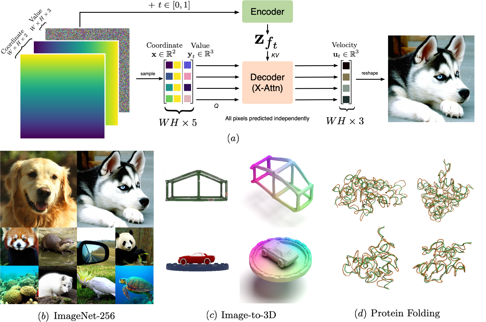

# INRFlow: Flow Matching for INRs in Ambient Space

---

<div align="center">

This github repository accompanies the research paper, [*INRFlow: Flow Matching for INRs in Ambient Space*](https://arxiv.org/abs/2412.03791) (ICML 2025).

*Yuyang Wang, Anurag Ranjan, Joshua M. Susskind, Miguel Angel Bautista*

[[`Paper`](https://arxiv.org/abs/2412.03791)]  [[`BibTex`](#citation)]



</div>


## Introduction

Flow matching models have emerged as a powerful method for generative modeling on domains like images or videos, and even on irregular or unstructured data like 3D point clouds or even protein structures. These models are commonly trained in two stages: first, a data compressor is trained, and in a subsequent training stage a flow matching generative model is trained in the latent space of the data compressor. This two-stage paradigm sets obstacles for unifying models across data domains, as hand-crafted compressors architectures are used for different data modalities. To this end, we introduce INRFlow, a domain-agnostic approach to learn flow matching transformers directly in ambient space. Drawing inspiration from INRs, we introduce a conditionally independent point-wise training objective that enables INRFlow to make predictions continuously in coordinate space. Our empirical results demonstrate that INRFlow effectively handles different data modalities such as images, 3D point clouds and protein structure data, achieving strong performance in different domains and outperforming comparable approaches. INRFlow is a promising step towards domain-agnostic flow matching generative models that can be trivially adopted in different data domains.

</div>


## Installation

We used a docker image with CUDA 12.2, Python 3.10 and Pytorch 2.5.0. To set up the environment: 
```
bash environment/setup.sh
```

## Dataset

Please refer to `image.py`, `imagenet.py`, `shapenet.py`, and `objaverse.py` in `datasets/` for expected data structure for different datasets reported in the paper.

## Train

The configuration of model is based on [`Hydra`](https://hydra.cc/docs/intro/). Settings of different experiments can be found in `configs/experiment`. To change dataset and model settings, one can refer to config files in `configs/data` and `configs/model`. Example scripts for training on ImageNet and ShapeNet are listed below:
```
python train experiment=inrflow_imagenet_256
python train experiment=inrflow_shapenet
```

## Test

To test model, follow the example script:
```
python test.py experiment=eval_image
python test.py experiment=eval_shapenet
```

## Resolution Agnostic Generation

To generate images or point clouds at arbitrary resolution, please refer to notebook `superres_image.ipynb` and `superres_pointcloud.ipynb`, respectively. 

## Citation
If you find our work useful, please consider citing us as:
```
@inproceedings{wang2025inrflow,
    title={INRFlow: Flow Matching for INRs in Ambient Space},
    author={Wang, Yuyang and Ranjan, Anurag and Jaitly, Navdeep and Susskind, Joshua M. and Bautista, Miguel {\'A}ngel},
    year={2025},
    booktitle={Forty-second International Conference on Machine Learning},
}
```